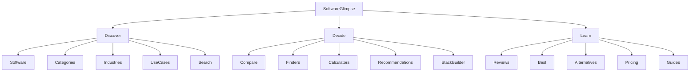

# Information architecture

## Activity map

## Canonical URL structure

Trailing slashes are **required** (`next.config.ts` → `trailingSlash: true`).

| Area | Pattern | Status in Phase 0 |
| --- | --- | --- |
| Home | `/` | Live, indexable |
| Software index | `/software/` | Live, indexable |
| Software entity | `/software/{slug}/` | Live for seeds |
| Categories | `/categories/` | Live, indexable |
| Category | `/categories/{...path}/` | Live for primary taxonomy |
| Industries | `/industries/` | Shell, noindex |
| Audience | `/for/` | Index + `/for/[slug]/` approved/indexable (CRM business types) |
| Best | `/best/` | Shell, noindex |
| Compare | `/compare/` | Shell, noindex |
| Alternatives | `/alternatives/` | Shell, noindex |
| Pricing | `/pricing/` | Shell, noindex |
| Tools | `/tools/` … | Shells, noindex |
| Guides | `/guides/` | Shell, noindex |

### IA decisions (vs prompt defaults)

1. **Keep `/for/` separate from `/industries/`** — audience/team-size ≠ industry vertical.
2. **Keep `/categories/[...slug]`** — supports nested subcategory paths without route explosion.
3. **Do not auto-create `/alternatives/{slug}/` or `/pricing/{slug}/` yet** — hubs exist; child routes wait for researched content (links may point ahead but stay noindex until built).
4. **Software finder CTA** links to `/tools/software-finder/` even before the tool ships.

## Indexability rules

A URL is sitemap-eligible / `robots.index=true` only when:

1. `metadata.status` ∈ `{ published, refresh-needed }`
2. `publishedAt` / `scheduledAt` are not in the future
3. `seo.indexable === true`
4. Page provides meaningful user value (editorial gate — not automated)

Empty hubs deliberately set `indexable: false`.

## Slug conventions

- lowercase kebab-case
- product brand normalized (`Apollo.io` → `apollo`)
- no dates in slugs
- stable once published (redirect on rename)

## Navigation

Primary: Software · Categories · Compare · Tools · Guides  
CTA: **Find My Software** → `/tools/software-finder/`
