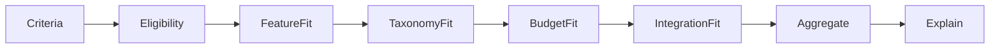

# Recommendation engine

## Goal

Map structured requirements → ranked products with explainable scores.

AI may parse natural language into `RecommendationCriteria` / finder answers. **Ranking stays deterministic.**

## First implementation: CRM Finder

See **[crm-finder.md](./crm-finder.md)** for the live UI + scoring wiring.

- Engine: `src/services/recommendation/` (`recommendCrm`, `normalizeCrmFinderAnswers`, `buildProductSnapshots`)
- Config: `src/data/config/recommendation/crm-finder-v1.ts`
- Domain: `src/domain/schemas/finder.ts` (`CrmFinderAnswers`, `FinderRecommendationResult`, …)
- UI: `/tools/crm-finder/` (indexable landing; client wizard; localStorage answers only)

## Input (`RecommendationCriteria` / `CrmFinderCriteria`)

- company size, team / CRM users
- industry, use cases
- budget (+ currency / per-user band)
- required features, preferred integrations
- technical capability / ease preference, region
- business maturity / business type
- deployment preference
- category scope (`crm` for the finder)

## Output (`RecommendationMatch` / `FinderRecommendationResult`)

- software slug + name
- match score / percentage (deterministic fit — not probability)
- confidence + breakdown
- why it matches / tradeoffs / unknowns
- estimated price when researched (via pricing fields on snapshots)
- labels / comparison path hints

## Scoring design



1. **Eligibility** — category / deployment / hard constraints (fail closed for explicit not-supported required features).
2. **Weighted dimensions** — configuration-driven weights in versioned data (not code constants scattered in UI).
3. **Penalties** — missing required features, over budget, poor fit tags.
4. **Explainability** — each score contribution becomes a “why” / “issue” string.
5. **Affiliate independence** — monetization metadata must not alter sort order.

## Configuration

Store scoring config as versioned data, e.g. `src/data/config/recommendation/crm-finder-v1.ts`:

- dimension weights
- hard filters
- budget band maps
- category-specific overrides

Engine signature:

```ts
recommendCrm(criteria, snapshots, config): { results, emptyReason?, methodologyVersion }
normalizeCrmFinderAnswers(answers, config?): CrmFinderCriteria
buildProductSnapshots(items): ProductRecommendationSnapshot[]
```

## Testing

Golden fixtures: fixed criteria + seed catalog → exact ranking and explanation keys (`src/services/recommendation/recommend.test.ts`, `npm run recommend:crm`).
